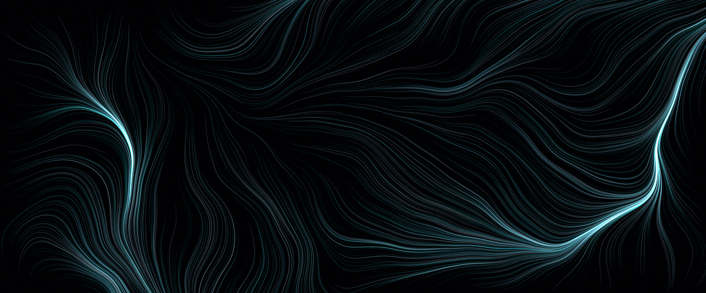
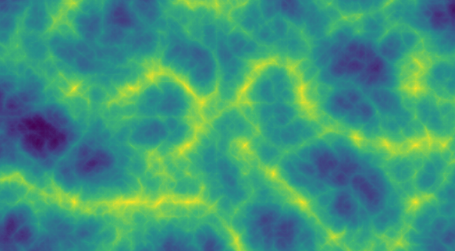
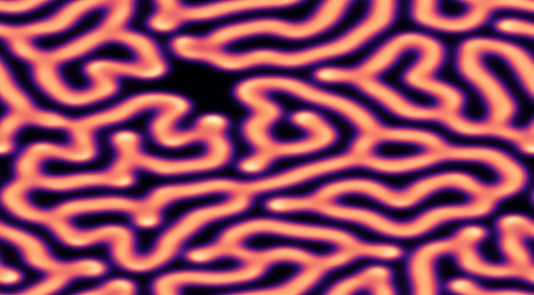
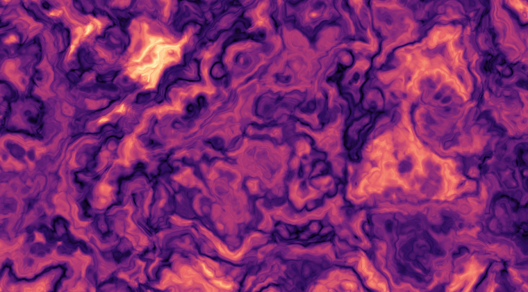
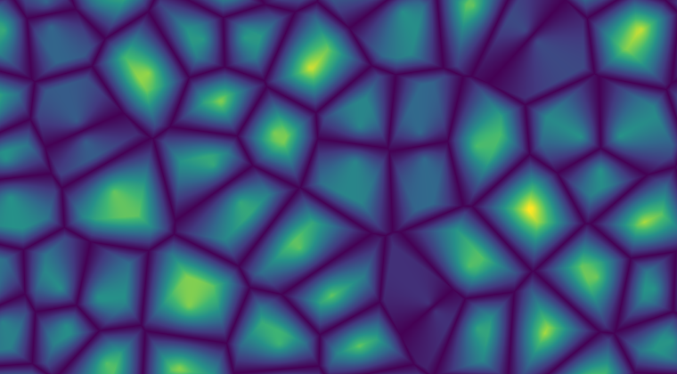
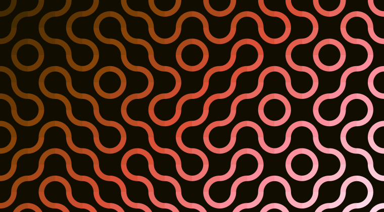
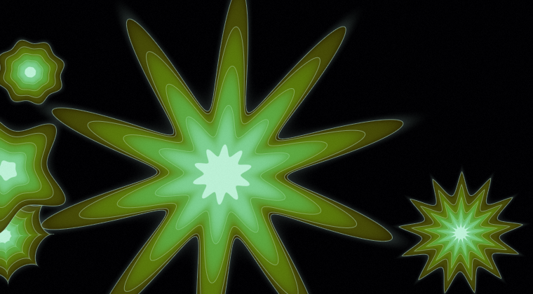
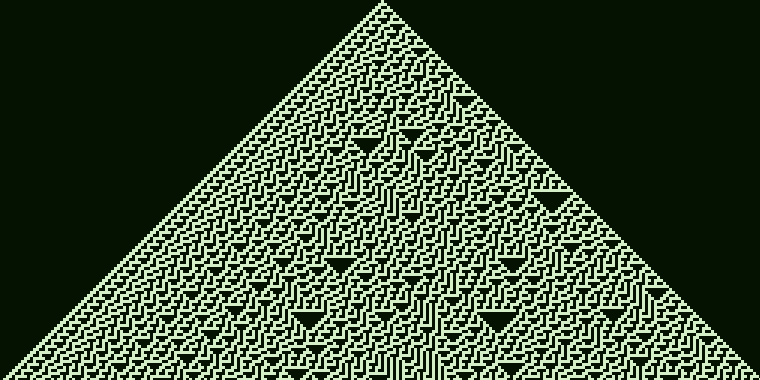
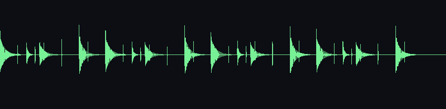
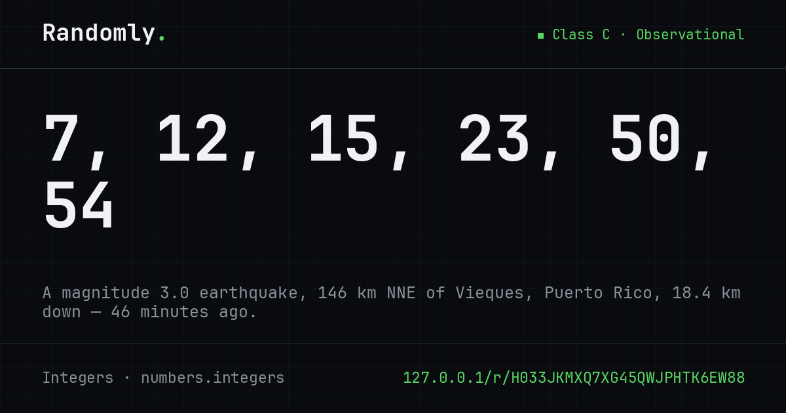

<div align="center">



# Randomly

### Randomness, sourced from reality.

**32 generators.** Numbers, words, equations, patterns, images, sound.
Every one seeded from the physical world. Every result ships with a receipt.

`673 tests` · `10 entropy sources` · `0 API keys` · `no database`

</div>

---

Most random tools call `rand()` and move on. Randomly makes the *source* of the
randomness the product:

> **20, 22, 26, 35, 47, 51**
> *A magnitude 3.6 earthquake, 67 km N of Culebra, Puerto Rico, 39.6 km down — 52 minutes ago.* [↗](https://earthquake.usgs.gov/earthquakes/eventpage/us7000th33)

That link goes to the USGS. You can check it. Every result on the site works this
way, and every result is reproducible from its own URL — with no database behind it,
because **the token *is* the seed**.

---

## What it makes

<table>
<tr>
<td width="50%"></td>
<td width="50%"></td>
</tr>
<tr>
<td><b>Ridged fBm</b> — seven octaves of Perlin noise, <code>Σ Aᵢ(1−|n(fᵢp)|)²</code></td>
<td><b>Gray–Scott</b> — two chemicals, explicit Euler, a 9-point Laplacian</td>
</tr>
<tr>
<td></td>
<td></td>
</tr>
<tr>
<td><b>Domain warping</b> — noise folded through a copy of itself</td>
<td><b>Worley F₂−F₁</b> — four distance metrics, one slider between them</td>
</tr>
<tr>
<td></td>
<td></td>
</tr>
<tr>
<td><b>Truchet tiles</b> — random orientation, drawn as a signed distance field</td>
<td><b>Superformula</b> — <code>r(φ) = (|cos(mφ/4)/a|^n₂ + |sin(mφ/4)/b|^n₃)^(−1/n₁)</code></td>
</tr>
<tr>
<td></td>
<td></td>
</tr>
<tr>
<td><b>Rule 30</b> — chaotic, and once Mathematica's random number generator</td>
<td><b>E(3,8)</b> — the Cuban tresillo, found by Bjorklund's algorithm</td>
</tr>
</table>

And the things that are not pictures:

```
words.passphrase   poster-haggler-spoils-bobbing-scrap-morbidity
                   77.5 bits · capitalisation and separators add 0.00 bits,
                   because the rule is deterministic

words.syllabic     Mirceeri · Thrinhailgleer · Girnailler · Nethyaebrin

equations.quadratic   -3x² + 3x + 126 = 0        →  x = -6  or  x = 7
equations.calculus    ∫ cos(x) - x·sin(x) dx     →  x·cos(x) + C
equations.identity    cos(2x) = 2cos(x)² + 1     →  False — a − became a +

numbers.dice       4d6kh3 → 12, 12, 14, 13, 11, 13
```

---

## Where the randomness comes from

Ten sources. All free, all keyless, all credited — and **classified honestly**.

| | Source | What it actually is | Class |
|---|---|---|---|
| ⚛ | **ANU Quantum Vacuum** | vacuum field fluctuations, homodyne detection in Canberra | A |
| 📡 | **RANDOM.ORG** | atmospheric radio noise, largely lightning, sampled in Dublin | A |
| 🔒 | **OS CSPRNG** | the kernel entropy pool of the machine serving the page | A |
| 🏛 | **NIST Beacon** | 512 bits published every minute, hash-chained and signed | B |
| 🌍 | **drand** | threshold BLS signature, League of Entropy | B |
| ⛏ | **Bitcoin** | the block hash the whole network spent ten minutes finding | B |
| 🌋 | **USGS Seismic** | every earthquake on Earth in the past hour | C |
| ☀ | **NOAA Space Weather** | the planetary K-index | C |
| 🌡 | **Live Weather** | temperature and wind at a randomly chosen city | C |
| 🛰 | **ISS Position** | the station's ground track, 408 km up | C |

**Class A** stands alone. **Class B** is unpredictable until published, then public
forever. **Class C** is flavour — an earthquake carries maybe thirty bits of genuine
surprise, not the twelve kilobytes its JSON weighs.

So Class B and C are *always* mixed with fresh CSPRNG bytes before anything is
generated, and **the receipt says so**. The site credits the earthquake for the
story and guarantees the cryptography separately. Both facts are true at once, and
both are on the page.

```json
"receipt": {
  "source": "seismic",
  "class": "C",
  "caveat": "Carries only tens of bits of genuine surprise. Always mixed with the OS CSPRNG.",
  "narrative": "A magnitude 3.6 earthquake, 67 km N of Culebra, Puerto Rico, 39.6 km down — 52 minutes ago.",
  "proof_url": "https://earthquake.usgs.gov/earthquakes/eventpage/us7000th33",
  "mixed_with_csprng": true,
  "degraded": false
}
```

A generator that consumes no randomness at all — an identicon is a pure function of
the text you type — **skips the entropy draw entirely** rather than crediting a
beacon that changed nothing about its output. A false receipt is the one thing this
project will not ship.

---

## How it works

**One contract.** A generator declares a `ParamSchema`, and the studio's control
panel, the API's validation, the catalogue entry and the permalink format all render
from that declaration. Adding a generator is one class plus one config line — no
route, no controller, no view.

**HKDF all the way down.** Raw source material is conditioned into a 16-byte seed
with HKDF-SHA256, mixed with fresh local entropy so a cached NIST pulse can never
yield a repeated seed. That seed expands into an endless deterministic byte stream.

**The token is the seed.** 16 bytes encode to 26 Crockford base32 characters, so a
permalink *recomputes* rather than looks up. No database, no storage, no accounts.

**Specs, not pixels.** Canvas and audio generators send a description — algorithm,
parameters, palette, a render key — and the browser re-derives the identical byte
stream and does the drawing. A four-minute generative piece is a 2 KB response, and
dragging a slider re-renders instantly without touching the server.

That last one is a real correctness claim, so it is tested: `RngParityTest` runs the
PHP and JavaScript implementations side by side and compares raw stream bytes,
integer draws *with their rejection counts*, doubles, shuffles and token decoding.

---

## Three rules the code enforces

|  | |
|---|---|
| `isSensitive()` | A password gets **no shareable seed**. A secret with a replayable URL is not a secret. |
| `isReproducible()` | A generator built on live external data gets **no permalink** — that link would resolve differently tomorrow. |
| `usesEntropy()` | A deterministic generator **skips the entropy draw**, instead of spending 850 ms on a beacon it will not use. |

<table>
<tr>
<td width="200"></td>
<td>

The identicon is where the third rule earns itself. It is a pure function of the
string you type — same input, same avatar, anywhere, forever, with nothing stored.
Randomness would defeat the entire point.

Before `usesEntropy()` existed, asking for this with `?source=drand` spent **850 ms**
waiting on a beacon and then attached a receipt reading *"derived from drand round
6,461,302"* to an image that would have been byte-identical had that round never been
published. It now takes **1 ms** and the receipt says what is true: *"This generator
is a pure function of what you typed."*

</td>
</tr>
</table>

And shipped versus planned generators live in disjoint lists, with a test that fails
if one appears in both — so the site can never advertise a generator it has not
written.

---

## The API

No key. No signup. No account. Rate limited to 60/minute.

```bash
curl -s 'https://randomly.test/api/v1/g/numbers.integers?count=6&min=1&max=60&unique=1' \
     -H 'Accept: text/plain'
# 20, 22, 26, 35, 47, 51
```

```
GET  /api/v1/generators        the whole catalogue, machine-readable
GET  /api/v1/sources           live status of all ten entropy sources
POST /api/v1/generate          {generator, params, source}
GET  /api/v1/g/{key}?…         the one-liner shorthand
GET  /api/v1/replay/{token}    recompute a past result exactly
```

The site's own pages call these same endpoints. There is no private path with
different behaviour.

---

## Every link previews itself

<div align="center">

</div>

Rendered server-side with GD, recomputed from the token, cached by content hash. The
receipt sentence travels in the URL — **signed**, because letting a query parameter
put arbitrary text on a card bearing the wordmark would be building a forgery
generator.

---

## Running it

```bash
composer install && npm install
cp .env.example .env && php artisan key:generate
npm run build
php artisan serve
```

```bash
php artisan randomly:seed --source=drand      # draw one seed, see its receipt
./vendor/bin/pest                             # 673 tests, no network, no database
```

**Stack:** Laravel 13 · PHP 8.5 · Blade + Alpine 3 + Tailwind 4 · Vite · Pest.
Requires `gd` for Open Graph cards and Node for the verification scripts.

---

## Verifying things assertions cannot see

Three classes of defect here are invisible to a test suite, so each gets a harness
that measures the real output:

| Script | Measures | Caught |
|---|---|---|
| `render-preview.mjs` | renders canvases to PNG under Node, no browser | mud-coloured palettes; a `Float32Array` rounding bug indexing `colours[-1]` |
| `analyse-audio.mjs` | spectral slope, pitch by autocorrelation, decay, peak | noise colours an octave-slope out; a Karplus–Strong filter running backwards |
| `check-latex.mjs` | parses generated LaTeX through real KaTeX | `e^{a}^{2}` — valid PHP output, invalid TeX |

Every one of those was found by *looking at the output*, not by a failing assertion.
The Gray–Scott labyrinth constant in the spec was wrong too, and rendering both
values side by side is the only reason anybody noticed.

---

## The specification

The whole project was specced before it was built. [`docs/`](docs/README.md) carries
the architecture, every module's algorithms and equations, the entropy conditioning,
the API contract, the brand direction and the build order — updated as
implementation contradicted it, with the contradictions written down.

| | |
|---|---|
| [Overview](docs/01-overview.md) · [Architecture](docs/02-architecture.md) · [Entropy](docs/03-entropy.md) | positioning, the contract, the sources |
| [Numbers](docs/04-module-numbers.md) · [Words](docs/05-module-words.md) · [Equations](docs/06-module-equations.md) | unbiased sampling, Diceware, backward construction |
| [Patterns](docs/07-module-patterns.md) · [Images](docs/08-module-images.md) · [Audio](docs/09-module-audio.md) | noise, colour, synthesis |
| [UI & Brand](docs/10-ui-brand.md) · [API](docs/11-api.md) · [Roadmap](docs/12-roadmap.md) | presentation, endpoints, what's next |

---

## Credits

Randomly stands on work it did not pay for and could not have afforded: RANDOM.ORG,
the Australian National University, NIST, the League of Entropy, mempool.space, the
USGS, NOAA, Open-Meteo, Open Notify, Wikipedia, GBIF, and the EFF's Diceware
wordlists (CC BY 3.0 US). Not one of them charges. Not one asked for a key. Every one
of them could have.

**Free does not mean uncredited.** The full list lives at `/credits`.

<div align="center">
<br>
<i>32 shipped · 31 specified · every one of them a class and a line of config away.</i>
</div>
